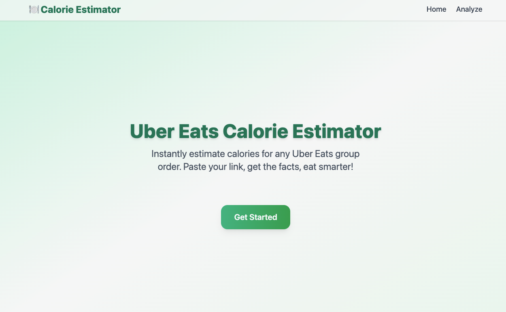
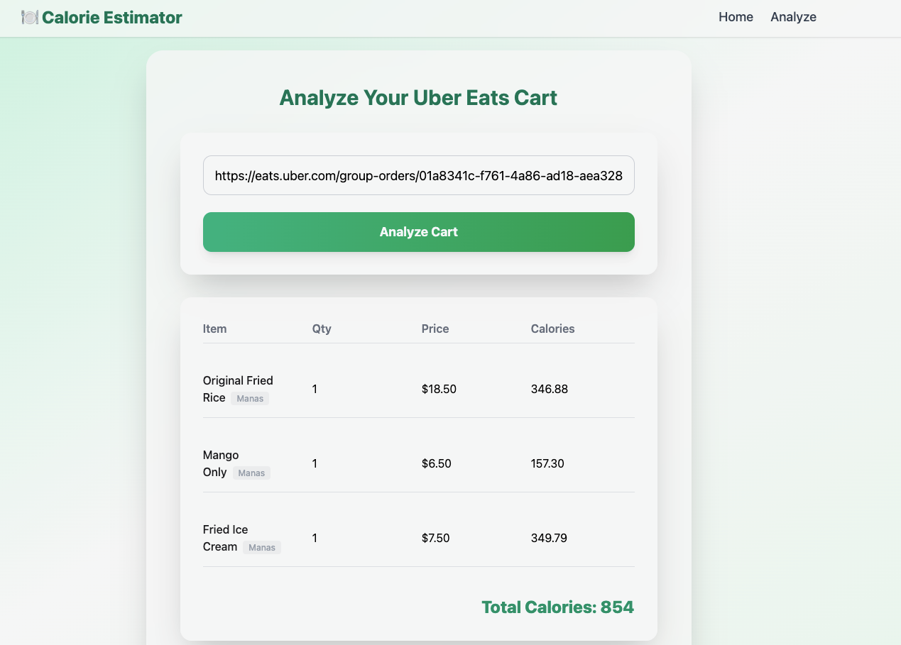

# Order Smarter 🍕

Order Smarter is a full-stack application that helps users estimate calories in their Uber Eats group orders by analyzing cart items and predicting calorie content using AI-powered microservices.

---

## Table of Contents
- [Overview](#overview)
- [Screenshots & Demo](#screenshots--demo)
- [Project Structure](#project-structure)
- [Tech Stack](#tech-stack)
- [Setup & Running Locally](#setup--running-locally)
- [Usage](#usage)
- [Features](#features)
- [Credits](#credits)

---

## Overview
Order Smarter lets you paste an Uber Eats group order link, scrapes the cart details, and predicts calories for each item using a deep learning model. The app orchestrates multiple services:
- **Frontend:** Modern React UI for user interaction
- **Backend:** Spring Boot orchestrator API
- **Microservices:**
  - [Uber Eats Cart Scraper](https://github.com/Manas2006/uber-eats-cart-scraper) (FastAPI, Playwright)
  - [Calorie NLP Model](https://github.com/Manas2006/calorie-nlp-model) (FastAPI, Deep Learning)

---

## Screenshots & Demo

| Screenshot 1 | Screenshot 2 | Screen Recording |
|--------------|--------------|-----------------|
|  |  |  |

---

## Project Structure
```
order-smarter/
├── backend/           # Spring Boot orchestrator
│   ├── src/          # Java source code
│   └── pom.xml       # Maven configuration
│
├── frontend/         # React frontend
│   ├── src/          # TypeScript source code
│   └── package.json  # NPM configuration
│
└── public/           # Screenshots & screen recordings for README
```

---

## Tech Stack
- **Frontend:** React, TypeScript, Material-UI, Vite
- **Backend:** Spring Boot (Java 17+), WebFlux
- **Microservices:**
  - [Uber Eats Cart Scraper](https://github.com/Manas2006/uber-eats-cart-scraper) (Python, FastAPI, Playwright)
  - [Calorie NLP Model](https://github.com/Manas2006/calorie-nlp-model) (Python, FastAPI, Deep Learning)

---

## Setup & Running Locally

### Prerequisites
- Java 17+ and Maven
- Node.js 16+ and npm
- Python 3.8+
- [Playwright](https://playwright.dev/python/) for Python (for the scraper)

### 1. Clone All Repositories
```bash
git clone <this-repo-url> order-smarter
# In separate folders:
git clone https://github.com/Manas2006/uber-eats-cart-scraper.git
# and
git clone https://github.com/Manas2006/calorie-nlp-model.git
```

### 2. Start the Python Microservices

#### Uber Eats Cart Scraper ([repo](https://github.com/Manas2006/uber-eats-cart-scraper))
```bash
cd uber-eats-cart-scraper
python -m venv .venv
source .venv/bin/activate
pip install -r requirements.txt
playwright install
python -m scraper.api  # Runs FastAPI on http://localhost:8000
```

#### Calorie NLP Model ([repo](https://github.com/Manas2006/calorie-nlp-model))
```bash
cd calorie-nlp-model
python -m venv .venv
source .venv/bin/activate
pip install -r requirements.txt
python -m calorie_nlp.api  # Runs FastAPI on http://localhost:8001
```

### 3. Start the Spring Boot Backend
```bash
cd order-smarter/backend
./mvnw spring-boot:run
# Or if mvnw is not executable:
mvn spring-boot:run
```

### 4. Start the React Frontend
```bash
cd order-smarter/frontend
npm install
npm run dev
# App runs at http://localhost:5173
```

---

## Usage
1. Open [http://localhost:5173](http://localhost:5173) in your browser.
2. Paste an Uber Eats group order link into the app.
3. Click analyze to see restaurant, items, and calorie predictions.
4. View results in a clean, responsive UI.

---

## Features
- Paste any Uber Eats group cart link
- Scrapes restaurant and item details
- Predicts calories per item using AI
- Modern, responsive UI (React + Material-UI)
- Real-time results
- Modular, microservice-based architecture
- Easy local development and deployment

---

## Credits
- **Uber Eats Cart Scraper:** [github.com/Manas2006/uber-eats-cart-scraper](https://github.com/Manas2006/uber-eats-cart-scraper)
- **Calorie NLP Model:** [github.com/Manas2006/calorie-nlp-model](https://github.com/Manas2006/calorie-nlp-model)
- **App Author:** [Your Name Here]

---

## License
MIT License. See LICENSE file for details. 
